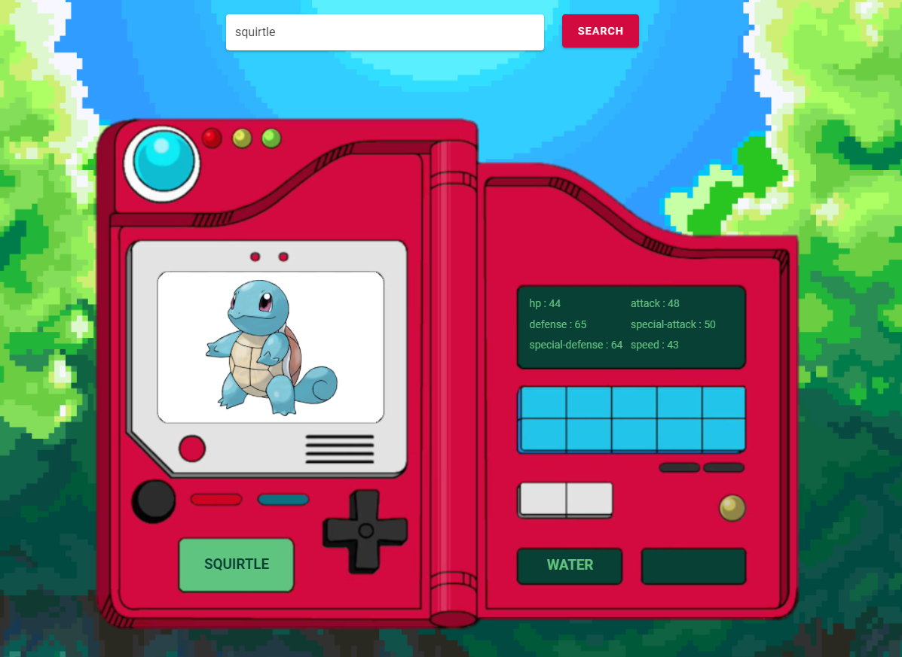

# Vue JS Pokedex 🐱
> This application was developed with API REST architecture in order to manage pokemon data.




### Functionalities

* Find Pokemon by name
* Find Next Pokemon
* Find Previous Pokemon

## Base URL

```sh
http://localhost:8080/
```


## Project setup
```
npm install
```

### Compiles and hot-reloads for development
```
npm run serve
```

### Compiles and minifies for production
```
npm run build
```

### Lints and fixes files
```
npm run lint
```


## Development setup

The following libraries were used:

-  Vuetify; ✔️ 
-  Axios; ✔️ 
-  Vue-router; ✔️ 
-  Pokéapi; ✔️ 

## Developer

<div align="center">
  <h3 align="center">Connect with me</h3> 
</div>
<p align="center">
 <a href="https://www.linkedin.com/in/michel-eckhardt-026121b1/" target="blank">
   &nbsp; &nbsp;
 </a>
 <a href="https://www.instagram.com/michel_eckhardt/" target="blank">
   &nbsp; &nbsp;
 </a>

## Contributing

1. Fork it (<https://github.com/michel-eckhardt/vue-pokedex>)
2. Create your feature branch (`git checkout -b feature/update`)
3. Commit your changes (`git commit -am 'Add some update'`)
4. Push to the branch (`git push origin feature/update`)
5. Create a new Pull Request
